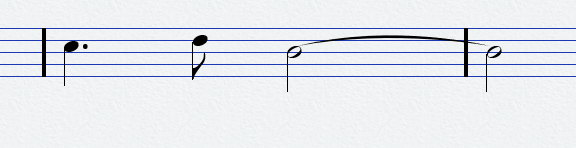
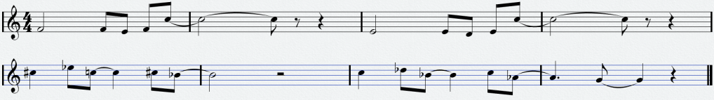

+++
date = '2024-09-22T10:50:38+03:00'
draft = false
title = 'Impressions Composing Jam: Ambience 1#'
series = 'Jam journals'
tags = ['Impressions jam']
+++
## Day 1
### Time to do some atmospheric stuff I guess?

Decided to use Cubase for this jam, after trying/learning Reaper for some jams/couple of months now. And in true authentic Cubase style, I managed to get Cubase to crash after only an hour 😂

Came up with a short 3 note figure/motif pretty quickly after starting to improv some ideas on a piano and started to sketch out some sort of a ambient/atmospheric track around a piano improv/sketch I recorded riffing around the 3 note motif I came up with.

I doubled the piano sketch with a more Pad like sound to get a washy/dreamy sound and took an old woodwind/reed synth sound I had made in Vital some time ago, and tweaked it a bit to get this morphing drone sound which I put in the background of the track, holding down the root note of the key, so in this case C, as this sketch was in C Lydian.

After getting some sort of an ambiance going with the effects and everything, I checked the jam discord and saw Kale’s post about how he was going to sing some norse poetry in his track and thought I could try something like that myself, so I looked up some Finnish poetry and decided to go with the poem Sydämeni Laulu by the “National Writer” of Finland Aleksis Kivi from his classic novel Seitsemän Veljestä (Mostly just chose one at random and Aleksis Kivi just because I share the same birthday with him 😄). I recorded a couple different takes of singing the first verse with different styles and then tried out different effects to make them sound, I guess dreamy?

Felt I had done enough for today, so I stopped for the day.
"I’ve found that working for an hour or two on a track is the most productive period for me, since after an hour or two I don’t really get much done. So I usually take a break after an hour or two and come back later with fresh ears and usually feeling more creative."

### The final state of the Day 1 sketch:
<iframe width="560" height="315" src="https://www.youtube.com/embed/7GO65ShTbY8?si=VyNj5DhAqrgpwXXX" title="YouTube video player" frameborder="0" allow="accelerometer; autoplay; clipboard-write; encrypted-media; gyroscope; picture-in-picture; web-share" referrerpolicy="strict-origin-when-cross-origin" allowfullscreen=""></iframe>

## Day 2
Remembered last night that I got the demo license for the Vienna MIR Pro 3D convolution reverb a week ago, so I decided to use that today to try and experiment with different distances between the sounds and instruments to get a nice “ambiance”, for which the MIR Pro turned out be really great and intuitive to use (its a bit pricy though, so not sure if I can ever justify spending that much money on a reverb😅)

I also found a great sample pack for Kontakt at Pianobook called [Folk Winds made by Hereafter Soundtracks](https://www.pianobook.co.uk/packs/folk-winds/). Pianobook is a community based website where people share sample libraries of instruments they’ve recorded, highly recommend checking it out if you’ve never been there!

I really liked the Wooden Flute and Recorder that were part of Folk Winds and decided to use those in the track.

After adding those to the project I felt that I had a pretty good amount of instruments to work with. Now the only thing left was actually to come up with an arrangement and parts for the different instruments, probably building on the sketch I’ve worked on for now or possibly taking the 3 note motif and other musical material and trying a new take on that.

I also removed all the effects on the vocals that made them pretty unintelligible and only used MIR Pro to put them in a space with the other sounds. I’m still a bit 50/50 if I’m going to do keep the vocal stuff or not, but I will decide on that later in the arranging process.
### How it sounded after the changes I made in the morning:
<iframe width="560" height="315" src="https://www.youtube.com/embed/0seqnipsf6g?si=4X0MkjscLMFUgNIC" title="YouTube video player" frameborder="0" allow="accelerometer; autoplay; clipboard-write; encrypted-media; gyroscope; picture-in-picture; web-share" referrerpolicy="strict-origin-when-cross-origin" allowfullscreen=""></iframe>

### Day 7
So….. I didn’t work on the track that much since Day 2 because even if I tried to start working on it, I really wasn’t feeling it at all. So I made the decision to just start fresh with a new track in a totally different style/direction. Since I previously used mostly real/acoustic instruments I decided to do the opposite for this one and just use synthesizers.

After loading up a synthesizer plugin with a pad sound, I first started to try and come up with some chord progressions since on the previous track I came up with the melody/motif first.

Spent an hour or so of trying out different things and ended up with progressions for the main part and maybe a bridge section?

After that I started filling out rest of the arrangement with a basic drum beat, bass following the root notes and some arpeggios outlining the chords.

Since I’m more of a fan of the older electronic music styles than the modern EDM stuff, all the synth/drum sounds I used ended up being pretty retro/synthwavey.

After I got the basic backing arrangement about done I started to figure out some sort of melody, thinking of using the motif from my previous track as the base somehow.

After trying different things I ended up with this 2 part melody, first a 2 bar figure that repeats once while moving with the chords and then a contrasting second half with the same form of 2 bar figure that repeats, and I based it on the previous tracks motif.

I got the base of the track at a pretty ok state now, so the next idea I had was to try and do some singing/vocal stuff for the lead melody but had pretty much 0 ideas on what to do for lyrics.

I’ve tried coming up with lyrics using ChatGPT and other LLM tools before, but I’ve found that most of the stuff those come up with is very repetitive and trite. The only good thing about those is that I feel detached from the lyrics since the machine wrote most of them, thus making those easier to try and sing, since there’s none of that feeling of awkwardness I get from having written the words myself.

While trying to come up with lyric ideas, I got some strong winter feelings from the chords and melodies, so I felt that the lyrics could be something about the themes of winter and maybe adventure since the track really felt like something from an old wintertime kid’s adventure movie 😂.

But seeing as I had started work on this track 2 hours ago and it was getting pretty late already, I decided to stop for the day and hopefully try and come up with some tomorrow.

### First sketch of the new track:
<iframe width="560" height="315" src="https://www.youtube.com/embed/pgtBh3d1YgY?si=zjMLJvSHXUsq3WEX" title="YouTube video player" frameborder="0" allow="accelerometer; autoplay; clipboard-write; encrypted-media; gyroscope; picture-in-picture; web-share" referrerpolicy="strict-origin-when-cross-origin" allowfullscreen=""></iframe>

## Day 8
Didn’t do much today. Just tweaked the voice leading to flow better thanks to FoxHyode’s recommendations on the jam discord and tried out to come up with some lyrics (not much luck on that part😅).

Since tomorrow is the last day for me, I’m probably going to just try and come up with something for the lyrics tomorrow and go with that even if I feel the lyrics are crap. So basically the same I did for the last jam, since I had the same issue during that 😄.

## Day 9

Ended up just scrapping the whole idea of adding vocals since that seemed to be a big roadblock for me during this jam, and just chose some instruments and added some melodic parts with those instead. After that I had already gotten the mix sounding pretty ok to me, so now all I had left to do was get the volume of the track nice and loud. For the mastering part I used a plugin called bx_masterdesk by brainworx that I had snagged for free some time ago but never actually used it. I’m not a production pro but the plugin felt like some sort of a combination of a compressor, eq and other stuff, presented with controls named using basic terms so even an idiot like me can use it without reading a manual 😉.

After I felt the volume was loud enough, I exported the track out as a WAV file and started to make the video for YouTube. For the video I decided to try and find a landscape painting of the northern lights during winter here in Finland, since that’s the feel/idea I got for the track from the text theme of **“Spirits in the north“**.
<iframe width="560" height="315" src="https://www.youtube.com/embed/pgtBh3d1YgY?si=zjMLJvSHXUsq3WEX" title="YouTube video player" frameborder="0" allow="accelerometer; autoplay; clipboard-write; encrypted-media; gyroscope; picture-in-picture; web-share" referrerpolicy="strict-origin-when-cross-origin" allowfullscreen=""></iframe>

After a couple google searches I found a nice landscape painting by the Finnish painter [Werner Holmberg](https://en.wikipedia.org/wiki/Werner_Holmberg), called [Revontulet](https://en.wikipedia.org/wiki/Werner_Holmberg#/media/File:Holmberg,_Revontulet.jpg), or Aurora as they’re called in English, put that as the video background and exported the video to YouTube.

Now all that was left was submitting, so I’ll end my rambling here 😌 

## Final submitted track:
<iframe width="560" height="315" src="https://www.youtube.com/embed/84jYNJVPdsk?si=Q1OwA7SefG-nm9HN" title="YouTube video player" frameborder="0" allow="accelerometer; autoplay; clipboard-write; encrypted-media; gyroscope; picture-in-picture; web-share" referrerpolicy="strict-origin-when-cross-origin" allowfullscreen=""></iframe>